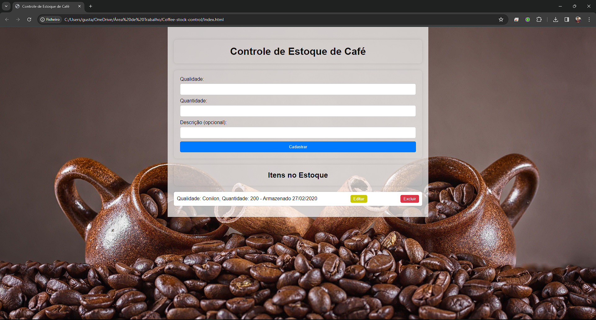

# Coffee-stock-control

The image below shows the project's graphical interface as a presentation to readers

This is a simple project with the aim of helping stock and coffee in a place, facilitating accounting.
In the future I intend to update it so that it can account for all stock from an overview, make a quote
in real time of the value of the coffee and tell an approximate value to what the user has stored, in addition to making it
more visually beautiful and intuitive for the user.

During the process of building this system, I learned new things and encountered challenges that I had never experienced before.
before, I gained a lot of new knowledge and it was a really cool process, I intend to continue this project and
learn much more with the new implementations!

Tecnologias utilizadas

HTML5, CSS e JAVASCRIPT.

## Projects that don't get off the ground are like dreams that don't come true.

## Author

👤 **Gustavo Vieira**
* Github: [@VIEIRAGUSTAVO](https://github.com/VIEIRAGUSTAVO)
* Linkedin: [@Gustavo Vieira](https://www.linkedin.com/in/gustavo-vieira-9237ab223/)

## Contributing
Contributions, issues and feature requests are welcome!

## Show your support
Give a ⭐️ if this project helped you!

## License

Copyright © 2021 [Gustavo Vieira](https://github.com/VIEIRAGUSTAVO). 
This project is [MIT](https://github.com/VIEIRAGUSTAVO/Jogo-pedra-papel-tesoura-mobile/commit/9ee3319e72c79f645016227bf26f7228526d05a5) licensed.

---

Made by 💙 by Gustavo Vieira.
